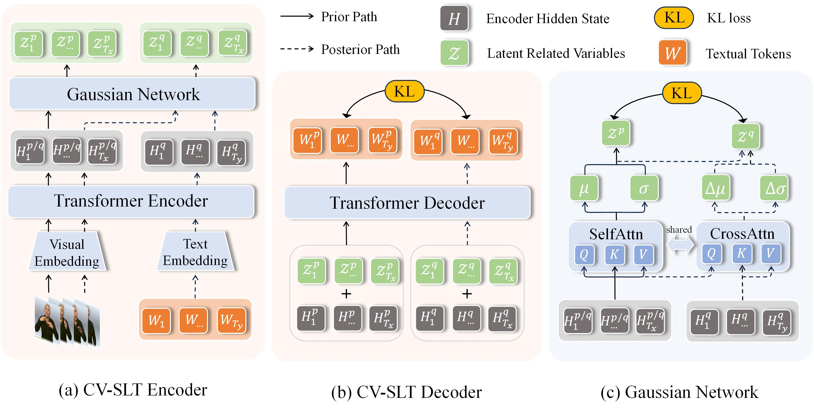

## CV-SLT

This repo holds codes of the paper: Conditional Variational Autoencoder for Sign Language Translation with Cross-Modal Alignment.

The CV-SLT takes [MMTLB](https://arxiv.org/abs/2203.04287) as a strong baseline, many thanks for their great work!

## Introduction

We propose CV-SLT to facilitate direct and sufficient cross-modal alignment between sign language videos and spoken language text. Specifically, our CV-SLT consists of two paths with two KL divergences to regularize the outputs of the encoder and decoder, respectively. In the *prior path*, the model solely relies on visual information to predict the target text; whereas in the *posterior path*, it simultaneously encodes visual information and textual knowledge to reconstruct the target text. Experiments conducted on public datasets (PHOENIX14T and CSL-daily) demonstrate the effectiveness of our framework, achieving new state-of-the-art results while significantly alleviating the cross-modal representation discrepancy. 



## Performance

| Dataset    | R (Dev) | B1    | B2    | B3    | B4    | R (Test) | B1    | B2    | B3    | B4    |
| ---------- | ------- | ----- | ----- | ----- | ----- | -------- | ----- | ----- | ----- | ----- |
| PHOENIX14T | 54.33   | 54.77 | 42.37 | 34.49 | 29.06 | 54.58    | 55.27 | 42.79 | 34.72 | 29.21 |
| CSL-daily  | 56.36   | 58.05 | 44.73 | 35.14 | 28.24 | 57.06    | 58.29 | 45.15 | 35.77 | 28.94 |

## Implementation

The implementation for the *prior path* and the *posterior path* (line 253) is given in  `./modeling/translation`

The Gaussian Network (line 44) equipped with ARGD (line 89) is given in `./modeling/gaussian_net`

### Prerequisites 

```sh
conda env create -f environment.yml
conda activate slt
```

### Data preparation

The raw data are from:

- [PHOENIX14T](https://www-i6.informatik.rwth-aachen.de/~koller/RWTH-PHOENIX-2014-T/)
- [CSL-daily](http://home.ustc.edu.cn/~zhouh156/dataset/csl-daily/)

Please refer to the [implementation](https://github.com/FangyunWei/SLRT/blob/main/TwoStreamNetwork/docs/SingleStream-SLT.md) of MMTLB for detailed data preparation and pre-trained models, as CV-SLT simply focuses on the SLT training. Specifically, the required processed data and pre-trained models include:

- Pre-extracted visual features for [PPHENIX14T](https://hkustconnect-my.sharepoint.com/:f:/g/personal/rzuo_connect_ust_hk/EndgQUATcNRCj0pTKPNMA_kBxSE9iJSONqj1zq1kQAAn5g?e=BgbJCK) and [CSL-daily](https://hkustconnect-my.sharepoint.com/:f:/g/personal/rzuo_connect_ust_hk/EjbL5fTAZbxOmGA5x7px8s8BbyJ4ml5e5TROB-GEWPXeBQ?e=Ks7GfH). Please download and place them under `./data`
- Pre-trained Visual Embedding and mBart [modules]([SingleStream - OneDrive (sharepoint.com)](https://hkustconnect-my.sharepoint.com/personal/rzuo_connect_ust_hk/_layouts/15/onedrive.aspx?id=%2Fpersonal%2Frzuo_connect_ust_hk%2FDocuments%2Fckpts%2FTwoStreamSLT%2FSingleStream&ga=1)). Please download the corresponding directories and place it under `./pretrained_models`

### Train and Evaluate

**Train**

```
dataset=phoenix-2014t #phoenix14t / csl-daily
python -m torch.distributed.launch --nproc_per_node 1 --use_env training.py \
  --config experiments/configs/SingleStream/${dataset}_vs2t.yaml
```

**Evaluate**

Upon finishing training, your can evaluate the model with:

```
dataset=phoenix-2014t #phoenix14t / csl-daily
python -m torch.distributed.launch --nproc_per_node 1 --use_env prediction.py  \
  --config experiments/configs/SingleStream/${dataset}_vs2t.yaml
```

We will make our checkpoints publicly available after anonymous peer review process to evaluate our model, as it is not convenient to attach such large files.

