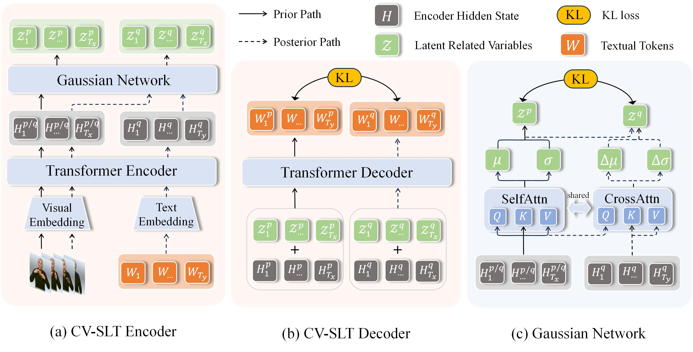

## CV-SLT

This repo holds codes of the [paper](https://arxiv.org/abs/2312.15645): Conditional Variational Autoencoder for Sign Language Translation with Cross-Modal Alignment.

The extended journal version, [Variational Sign Language Translation](https://link.springer.com/article/10.1007/s11263-026-02978-x), has been accepted by the *International Journal of Computer Vision* (IJCV).

The CV-SLT builds upon the strong baseline [MMTLB](https://arxiv.org/abs/2203.04287), many thanks to their great work!

## News

- **[Aug. 2026]** Our extended paper, [Variational Sign Language Translation](https://link.springer.com/article/10.1007/s11263-026-02978-x), was accepted by IJCV and is now available online. The journal version extends our experiments to the gloss-free setting and introduces the [CSL-Clinic](https://github.com/rzhao-zhsq/CSL-Clinic) dataset. &#x2714;
- **[April. 2024]**  Prepare and release the pre-trained ckpts. &#x2714;
- **[April. 2024]**  Clean and release the codes. &#x2714;

## Introduction

We propose CV-SLT to facilitate direct and sufficient cross-modal alignment between sign language videos and spoken language text. Specifically, our CV-SLT consists of two paths with two KL divergences to regularize the outputs of the encoder and decoder, respectively. In the *prior path*, the model solely relies on visual information to predict the target text; whereas in the *posterior path*, it simultaneously encodes visual information and textual knowledge to reconstruct the target text. Experiments conducted on public datasets (PHOENIX14T and CSL-daily) demonstrate the effectiveness of our framework, achieving new state-of-the-art results while significantly alleviating the cross-modal representation discrepancy. 



## Performance

### Gloss-based setting

#### PHOENIX14T and CSL-Daily

| Dataset    | ROUGE | B@1   | B@2   | B@3   | B@4   |
| ---------- | ----- | ----- | ----- | ----- | ----- |
| PHOENIX14T | 54.91 | 55.89 | 43.70 | 35.74 | 30.20 |
| CSL-daily  | 58.19 | 58.33 | 45.43 | 36.08 | 29.23 |

#### CSL-Clinic

| Method | RGB | Pose | WER &darr; | ROUGE | B@1 | B@2 | B@3 | B@4 |
| --- | :---: | :---: | ---: | ---: | ---: | ---: | ---: | ---: |
| TS-SLT | &#x2714; | &#x2714; | 47.11 | 61.10 | 61.41 | 50.04 | 41.52 | 34.56 |
| HyperSign | &#x2714; | &#x2714; | - | 60.50 | 61.67 | 50.33 | 41.89 | 34.60 |
| SLRT | &#x2714; | &#x2718; | 63.21 | 44.01 | 42.39 | 31.25 | 23.57 | 18.38 |
| ConSLT | &#x2714; | &#x2718; | - | 46.30 | 42.96 | 32.66 | 25.46 | 20.50 |
| MCL-SLT | &#x2714; | &#x2718; | - | 47.06 | 45.05 | 34.11 | 26.51 | 21.29 |
| MMTLB | &#x2714; | &#x2718; | 50.66 | 57.74 | 57.29 | 45.91 | 37.58 | 31.33 |
| TS-SLT-V | &#x2714; | &#x2718; | 52.11 | 57.63 | 58.01 | 46.89 | 38.64 | 32.48 |
| **VSLT** | &#x2714; | &#x2718; | 50.66 | 61.39 | 58.99 | 48.27 | 39.98 | 33.69 |

### Gloss-free setting

In the gloss-free setting, we remove the S2G (sign-to-gloss) pre-training stage.

| Dataset | ROUGE | B@1 | B@2 | B@3 | B@4 |
| --- | ---: | ---: | ---: | ---: | ---: |
| PHOENIX14T | 49.94 | 51.33 | 39.18 | 31.79 | 26.83 |
| CSL-Daily | 48.07 | 48.98 | 36.34 | 27.87 | 21.97 |
| OpenASL | 48.07 | 48.98 | 36.34 | 27.87 | 21.97 |
| How2Sign | 48.07 | 48.98 | 36.34 | 27.87 | 21.97 |

## Implementation

- The implementation for the *prior path* and the *posterior path* is given in  `./modeling/translation.py`

- The Gaussian Network equipped with shared ARGD is given in `./modeling/gaussian_net.py`

### Prerequisites 

```sh
conda env create -f environment.yml
conda activate slt
```

### Data preparation

The raw data are from:

- [PHOENIX14T](https://www-i6.informatik.rwth-aachen.de/~koller/RWTH-PHOENIX-2014-T/)
- [CSL-daily](http://home.ustc.edu.cn/~zhouh156/dataset/csl-daily/)
- [CSL-Clinic](https://github.com/rzhao-zhsq/CSL-Clinic)

Please refer to the [implementation of MMTLB](https://github.com/FangyunWei/SLRT/blob/main/TwoStreamNetwork/docs/SingleStream-SLT.md)  for preparing the data and models, as CV-SLT simply focuses on the SLT training. Specifically, the required processed data and pre-trained models include:

- Pre-extracted visual features for [PHENIX14T](https://hkustconnect-my.sharepoint.com/:f:/g/personal/rzuo_connect_ust_hk/EndgQUATcNRCj0pTKPNMA_kBxSE9iJSONqj1zq1kQAAn5g?e=BgbJCK) and [CSL-daily](https://hkustconnect-my.sharepoint.com/:f:/g/personal/rzuo_connect_ust_hk/EjbL5fTAZbxOmGA5x7px8s8BbyJ4ml5e5TROB-GEWPXeBQ?e=Ks7GfH). Please download and place them under `./experiment`
- Pre-trained Visual Embedding (trained on s2g task) and mBart modules (trained on g2t task) following [MMTLB](https://hkustconnect-my.sharepoint.com/:f:/g/personal/rzuo_connect_ust_hk/EuJlnAhX7h9NnvFZhQH-_fcBtV8lbnj2CphiuidhhcU69w?e=eOsQ4B). Please download the corresponding directories and place them under `./pretrained_models` 

> Note that the path is configured in the \*.yaml file and you can change it anywhere you want.
>
> We backup the ckpts used in this repo [here](https://1drv.ms/f/s!Alt7L3J6LlN7nQuEc33dZokyvArb?e=SQIvQX). 

### Train and Evaluate

**Train**

```
dataset=phoenix-2014t #phoenix14t / csl-daily
python -m torch.distributed.launch \
--nproc_per_node 1 \
--use_env training.py \
--config experiments/configs/SingleStream/${dataset}_vs2t.yaml
```

**Evaluate**

Upon finishing training, your can evaluate the model with:

```
dataset=phoenix-2014t #phoenix14t / csl-daily
python -m torch.distributed.launch \
--nproc_per_node 1 \
--use_env prediction.py  \
--config experiments/configs/SingleStream/${dataset}_vs2t.yaml
```

You can also reproduce our reported performance with our trained ckpts.

- [phoenix-2014t_vs2t](https://1drv.ms/f/s!Alt7L3J6LlN7nQ3YlGmt4I8f9bIw?e=4knQU1)  
- [csl-daily_vs2t](https://1drv.ms/f/s!Alt7L3J6LlN7nQ-k7S7e6LOl3Sll?e=x9gZEu)  

We also provide a trained g2t ckpt of CSL-daily to help re-train our CV-SLT since it is lost in the repo of MMTLB.

- [csl-daily_g2t](https://1drv.ms/f/s!Alt7L3J6LlN7nRHnpATRKLTFMMXN?e=rpa2CB), the blue scores are `35.24/34.70` on Dev/Test sets.

## Citation

```
@InProceedings{
    Zhao_2024_AAAI,
    author    = {Rui Zhao, Liang Zhang, Biao Fu, Cong Hu, Jinsong Su, Yidong Chen},
    title     = {Conditional Variational Autoencoder for Sign Language Translation with Cross-Modal Alignment},
    booktitle = {Proceedings of the AAAI Conference on Artificial Intelligence},
    year      = {2024},
}
@Article{
    Zhao_2026_IJCV,
    author  = {Zhao, Rui and Zhang, Liang and Fu, Biao and Zhang, Ruiquan and Chen, Yidong and Shi, Xiaodong},
    title   = {Variational Sign Language Translation},
    journal = {International Journal of Computer Vision},
    volume  = {134},
    pages   = {408},
    year    = {2026},
    doi     = {10.1007/s11263-026-02978-x},
    url     = {https://doi.org/10.1007/s11263-026-02978-x},
}
```

